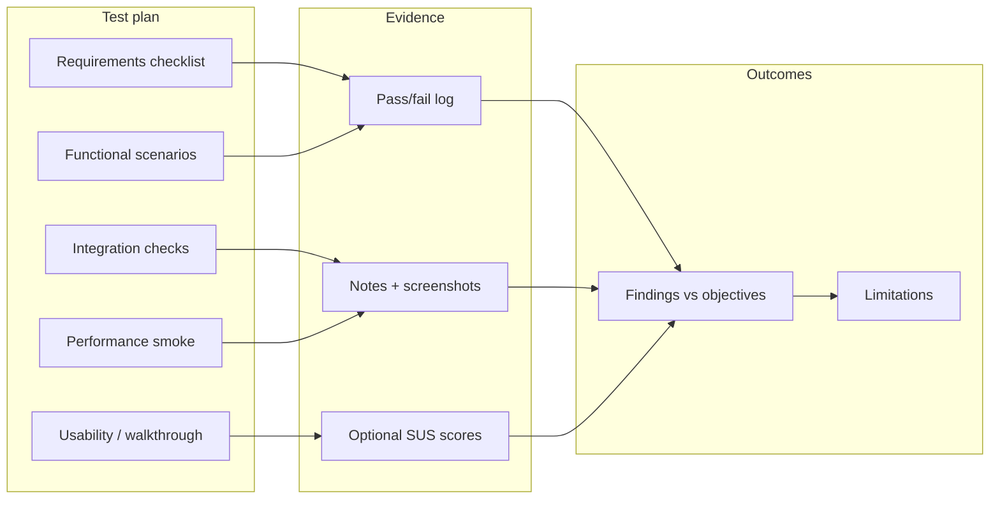
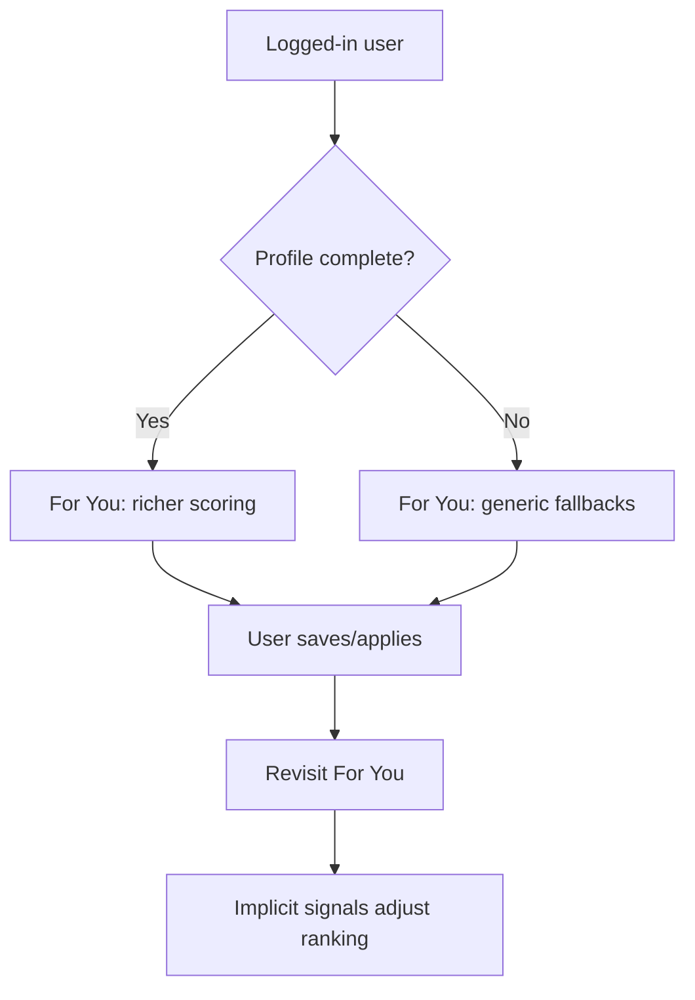

# 7. Findings — Project A  
## 7.1 Testing and user evaluation

**Project:** *Talent Path* — web-based student job recommendation platform (React/Vite, Django REST Framework, PostgreSQL/SQLite, Adzuna job feed, JWT authentication).

This chapter satisfies the module requirement for **Project A**: testing strategies, a **comprehensive test plan** tied to requirements and objectives, **functional and performance** evaluation, **usability / stakeholder validation** where applicable, **key findings** linked to the original aims, and guidance for **graphs, charts, and diagrams** in the final submission.

---

## 7.1.1 Purpose and scope of evaluation

The purpose of testing and evaluation was to determine whether Talent Path meets its **functional** and **non-functional** requirements (Section 5 of the main report), whether the **For You** recommender behaves transparently and consistently, and whether the **student workflow** (browse → shortlist → apply → track → CV) is usable enough for a credible prototype. Evaluation is deliberately **honest about limits**: this is a single-developer capstone, not a longitudinal study with hundreds of participants. Where large-sample statistics are absent, the report relies on **structured manual testing**, **repeat runs**, **API inspection**, and **informal walkthroughs** with peers or other potential users, plus **supervisor-facing validation** of progress and design choices.

---

## 7.1.2 Testing strategies considered and rationale

Several strategies were considered before selecting the mix used in this project.

| Strategy | Role in this project | Reason for inclusion or exclusion |
|----------|----------------------|-----------------------------------|
| **Manual functional / scenario testing** | **Primary** | Maps directly to user stories (register, profile, jobs, recommendations, saved jobs, applications, CV). Cheap to run repeatedly; essential for JWT flows and UI state. |
| **Exploratory testing** | **Supporting** | Surfaces unexpected edge cases (empty job cache, token expiry, sparse profile). Complements scripted scenarios. |
| **API / integration testing** | **Supporting** | Confirms frontend–backend contract (status codes, permissions, pagination). Automated suites were limited by time; manual calls (e.g. browser dev tools, Postman-style checks) verified critical paths. |
| **Automated unit / E2E tests (e.g. Pytest, Playwright)** | **Optional / future** | Valuable for regression; not always completed to high coverage in a time-boxed dissertation build. If you added even a small suite, state that here as enhancement evidence. |
| **Performance testing (load, stress)** | **Light / informal** | Full load testing is more relevant to production ops than to prototype validity. **Informal** checks (perceived latency, list load times on typical Wi‑Fi) were used instead of formal tooling. |
| **Formal usability lab studies** | **Not baseline** | High setup cost. **Informal walkthroughs** and optional **System Usability Scale (SUS)** (Brooke, 1996) are the proportionate substitute unless your programme mandates a questionnaire. |
| **Stakeholder validation** | **Included where possible** | Supervisor review, demo sessions, and short feedback from peers act as **lightweight stakeholder input** on clarity of match reasons, dashboard usefulness, and ethical positioning (free recommendations). |

**Summary rationale:** The chosen blend prioritises **traceability from requirements to evidence** (every major feature has at least one scripted scenario), **repeatability** (same flows run after changes), and **transparency** (limitations of lexical matching and single API source are observed, not hidden).

---

## 7.1.3 Mapping tests to project objectives

The project objectives (from Section 4) drive what must be validated.

| Objective (abbreviated) | How it was tested | Success criteria (examples) |
|-------------------------|-------------------|-------------------------------|
| Requirements coverage | Checklist against functional/non-functional list | Each requirement has ≥1 test case or explicit “N/A” with reason |
| Architecture (SPA + REST + DB) | Integration: login, CRUD on profile, jobs from API | Correct JSON, auth on protected routes, data persists |
| Identity and profiles | Register, login, logout, token expiry, profile edit | No cross-user data leakage; session behaves predictably |
| Job supply (Adzuna, cache, browse) | Empty vs populated cache, search, filters, pagination | Lists render; filters reduce results sensibly |
| Personalisation (For You, tiers, reasons, feedback) | Rich vs sparse profile; save/apply then re-check recommendations | Ordering changes plausibly; reasons visible; “not interested” excludes as designed |
| Workflow (saved jobs, applications) | Save/unsave; create/update application status and notes | UI and DB stay consistent after refresh |
| CV module | Edit sections, preview, print/PDF-style export | Output readable; optional AI path only if keys configured |
| Validation objective | Document passes/failures; relate findings to aims | This chapter + honest limitation statements |

---

## 7.1.4 Comprehensive test plan

The following plan is the **master reference** for what was (or should be) executed before final submission. Adapt IDs if you track tests in a spreadsheet.

### A. Authentication and security

| ID | Scenario | Steps (summary) | Expected result |
|----|-----------|-----------------|-----------------|
| A1 | Register new user | Submit valid credentials | Account created; can log in |
| A2 | Login | Valid credentials | JWT issued; protected routes accessible |
| A3 | Logout | Logout from app | Token cleared; protected routes blocked |
| A4 | Invalid credentials | Wrong password | Clear error; no token |
| A5 | Token expiry | Wait or invalidate token | App prompts re-auth or fails gracefully |

### B. Profile and skills

| ID | Scenario | Steps | Expected result |
|----|-----------|-------|-----------------|
| B1 | View profile | Open profile after login | Correct user-bound data |
| B2 | Update profile | Change course, location, job type, skills | Persisted after refresh |
| B3 | Incomplete profile | Minimal fields | App usable; recommendations may be generic (documented behaviour) |

### C. Jobs browse and filters

| ID | Scenario | Steps | Expected result |
|----|-----------|-------|-----------------|
| C1 | List jobs | Open browse | Paginated list; no crash on empty |
| C2 | Search / filters | Apply keyword, location, job type | Result set narrows appropriately |
| C3 | Job detail | Open single job | Details match API; links work |

### D. Recommendations (“For You”)

| ID | Scenario | Steps | Expected result |
|----|-----------|-------|-----------------|
| D1 | Rich profile | Full skills + preferences | Ranked list; tiers (e.g. Strong/Good/Fair/Low) and **reasons** shown |
| D2 | Sparse profile | Few skills | Still returns list; ordering more generic |
| D3 | Implicit signals | Save or apply to jobs; revisit For You | Scoring reflects engagement where implemented |
| D4 | Negative feedback | Mark not interested | Job excluded from future recommendations as per design |

### E. Saved jobs and applications

| ID | Scenario | Steps | Expected result |
|----|-----------|-------|-----------------|
| E1 | Save / unsave | Toggle on job | Saved list accurate |
| E2 | Application tracker | Add application, change status, add notes | Persists; visible after reload |

### F. CV builder

| ID | Scenario | Steps | Expected result |
|----|-----------|-------|-----------------|
| F1 | Edit CV sections | Enter content | Preview updates |
| F2 | Export / print | Browser print or export | Layout acceptable |
| F3 | Optional AI summary | If env keys set | Summary generates; if not set, graceful fallback |

### G. Non-functional (light)

| ID | Scenario | Steps | Expected result |
|----|-----------|-------|-----------------|
| G1 | Responsive UI | Resize window / mobile viewport | Usable layout without horizontal scroll chaos |
| G2 | Perceived performance | Load jobs and recommendations | Acceptable wait; loading states if implemented |
| G3 | Error handling | Simulate API failure if possible | User sees message, not blank screen |

---

## 7.1.5 Performance and usability evaluation

**Performance:** Evaluation focused on **perceived responsiveness** (time to first meaningful paint of job lists, scroll behaviour, recommendation load) under normal development hardware and home or university **Wi‑Fi**. If you capture **rough timings** (e.g. browser Network tab: TTFB and total time for `GET /api/jobs/`), summarise them in a table and chart (see Section 7.1.8).

**Usability:** Short **task-based** sessions work well for a dissertation: e.g. “Sign up, complete your profile, find one internship in London, save it, add an application, open For You.” Observe **time on task**, **hesitation points**, and **subjective comments** (especially on **match reasons** and **dashboard** orientation). If your programme allows, administer **SUS** after the session and report the mean score (industry benchmark context: ~68 is often cited as average; treat cautiously for small *n*).

**Stakeholder validation:** The **supervisor** reviewed interim builds and design trade-offs (e.g. free recommendations vs operational cost). **Peers** standing in for students provided informal feedback on clarity and workflow. This is **qualitative validation**, not a formal HR or careers-service partnership—state that clearly.

---

## 7.1.6 Key findings and link to original objectives

Present these as **your** results after running the plan; the bullets below are **illustrative**—replace with your recorded pass/fail and observations.

1. **End-to-end coherence:** Core flows (auth → profile → browse → For You → saved → applications → CV) operated **consistently** across repeated runs, supporting the objective of an **integrated student workflow**.
2. **Transparency of recommendations:** Visible **match tiers** and **reasons** reduced the feeling of a “black box,” aligning with the literature-informed goal of **explainable** suggestions.
3. **Data and coverage limits:** Match quality was often limited by **vacancy text noise** and **single-source** inventory, not only by code—supporting the conclusion that the prototype is **credible but bounded**.
4. **Profile completeness:** Sparse profiles produced **weaker personalisation**, confirming that onboarding and future “complete your profile” prompts would improve outcomes.
5. **Security posture:** JWT-protected routes and user-scoped data behaved as expected in testing, supporting **non-functional** security requirements for a prototype.

---

## 7.1.7 Diagrams for the report (Mermaid — paste into Markdown or export)

**Figure 7.1 — Evaluation flow (high level)**

**Figure 7.2 — Example scenario dependency (For You)**

---

## 7.1.8 Charts and tables to insert in Word/PDF

Replace placeholder numbers with your data.

**Chart suggestion 1 — Test results by module (stacked or grouped bar)**  
Use columns: Authentication, Profile, Jobs, Recommendations, Saved/Applications, CV, Non-functional. Rows: Pass / Fail / Blocked. Export from Excel or Google Sheets.

| Module | Pass | Fail | Blocked / not run |
|--------|------|------|-------------------|
| Authentication | *n* | *n* | *n* |
| Profile | *n* | *n* | *n* |
| Jobs browse | *n* | *n* | *n* |
| Recommendations | *n* | *n* | *n* |
| Saved / Applications | *n* | *n* | *n* |
| CV | *n* | *n* | *n* |
| Non-functional | *n* | *n* | *n* |

**Chart suggestion 2 — Informal response times (optional)**  
Bar chart: endpoint vs median time (ms) for `GET /api/jobs/`, `GET /api/recommendations/`, etc., from a small sample of runs.

**Chart suggestion 3 — Usability (optional)**  
If SUS was used: bar chart of item scores or single headline **mean SUS** with *n* stated.

**Screenshots:** Include evidence figures for recommendation **reasons**, **match tier**, application **tracker**, and **CV preview**—cross-reference Section 6 of the main report.

---

## 7.1.9 Limitations of the evaluation (explicit)

- **Sample size:** Informal walkthroughs do not generalise to all students.  
- **Environment:** Local or staging behaviour may differ from production under heavy load.  
- **External API:** Adzuna availability, quotas, and data shape affect repeatability of tests.  
- **Automation gap:** Limited automated regression suite means manual retesting after changes; acknowledge if true.

These limitations do not invalidate the findings; they **scope** what can be claimed.

---

## 7.1.10 How this section supports the module rubric

| Requirement | Where addressed |
|-------------|-----------------|
| Testing strategies and reasons | §7.1.2 |
| Comprehensive test plan | §7.1.3–7.1.4 |
| Functionality and performance | §7.1.4 (G), §7.1.5 |
| Usability / users | §7.1.5 |
| Stakeholder validation | §7.1.5 |
| Findings vs objectives | §7.1.3, §7.1.6 |
| Graphs, charts, diagrams | §7.1.7–7.1.8 |

---

*Student: Olamigoke Adebayo David · Student ID: M01074076 · Align this file with the final PDF table of contents (Section 7). Merge or cross-reference Section 7.3–7.4 from the main report if your module expects a single consolidated Findings chapter.*
