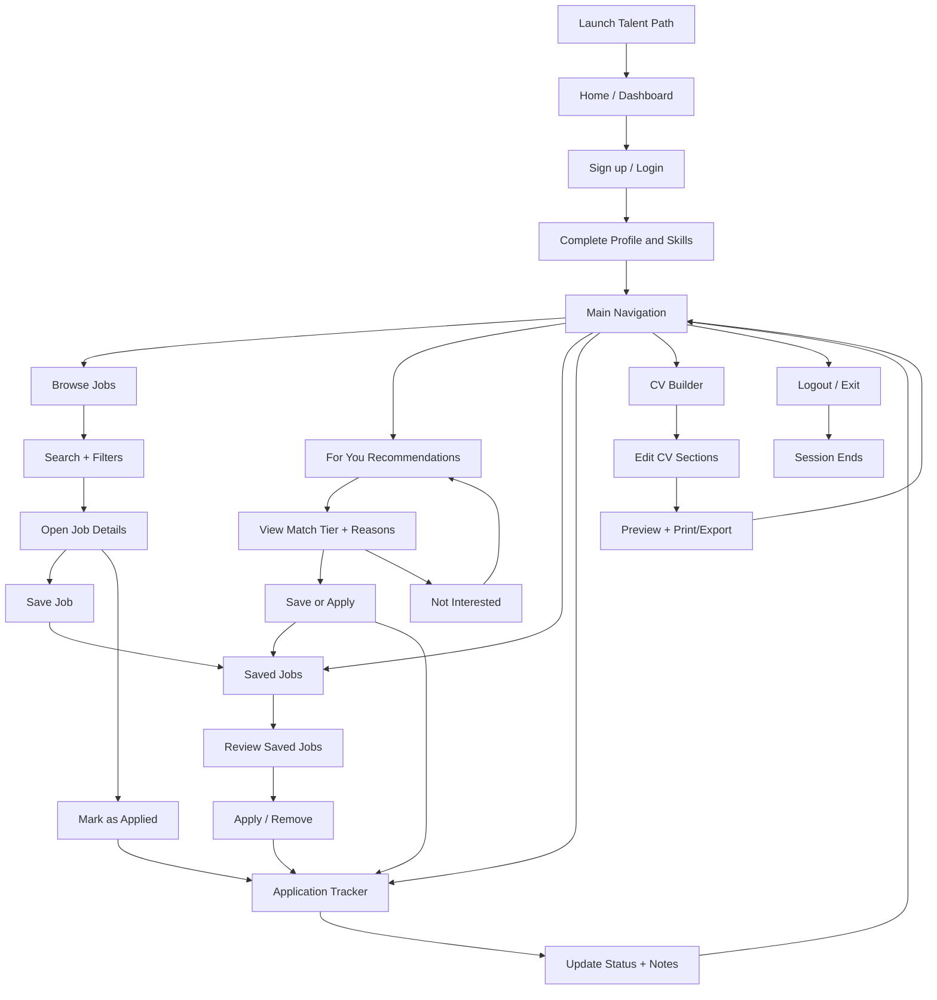

# MIDDLESEX UNIVERSITY  
**THE BURROUGHS, HENDON LONDON NW4 4BT**

---

**Title:** *Talent Path:* Design and Development of a Web-Based Student Job Recommendation Platform  

**Student Name:** Olamigoke Adebayo David  
**Student ID:** M01074076  
**Supervisor Name:** [Insert name]

---

*A thesis submitted in partial fulfilment of the requirements for the degree of Bachelor of Science (Development Project).*

---

## Table of contents

- [Acknowledgements](#acknowledgements)
- [1. Abstract](#1-abstract)
- [2. Description of the project](#2-description-of-the-project)
- [3. Literature review](#3-literature-review)
- [4. Aims and objectives](#4-aims-and-objectives)
- [5. Methods and methodology](#5-methods-and-methodology) (includes requirements, data collection, analysis, process, testing, timeline)
- [6. Work done – results](#6-work-done--results)
- [7. Findings](#7-findings)
- [8. Conclusion](#8-conclusion)
- [9. References](#9-references)
- [10. Appendix](#10-appendix)

*(Replace bracketed page numbers when you convert this document to Word or PDF.)*

---

## Acknowledgements

I am grateful to my supervisor and to the teaching staff at Middlesex University who offered guidance, critical questions, and practical suggestions while this project took shape. Their feedback encouraged me to look beyond “it works on my machine” and to think about users, limitations, and how the work sits within existing job platforms.

My family and friends supported me through deadlines and iteration, and I also owe a debt to the open-source communities behind Django, React, and the many libraries that made a full-stack project feasible within the timeframe. Finally, I acknowledge the documentation and API resources provided by third-party services used in the build, without which integration would have been far harder.

---

## 1. Abstract

### 1.1 What the author did

This project delivers **Talent Path**, a web application aimed at university students and recent graduates who need to find work that reasonably fits their **degree**, **skills**, and **stated preferences** (such as location and job type). Rather than treating the student as a generic job seeker, the system collects a structured profile, pulls vacancies from an external feed, and surfaces a **“For You”** list that is ranked and explained using transparent match reasons. Alongside discovery, the application supports **saved jobs**, **application tracking** with statuses and notes, and a **CV builder** with live preview and print or PDF-style export. Optional tooling can assist with CV wording; the core product does **not** charge students for recommendations or for browsing jobs.

### 1.2 How the author did it

Talent Path was implemented as a **client–server** system. The frontend is a **React (Vite)** single-page application styled with **Tailwind CSS**; the backend is **Django REST Framework**, exposing JSON APIs and using **JWT** authentication. Persistent data (users, profiles, skills, cached jobs, saved items, applications, and recommendation feedback) are stored in a relational database—**PostgreSQL** in production-style deployment and **SQLite** for straightforward local development. Vacancies are ingested via the **Adzuna API** (UK-focused configuration in this implementation). The recommendation logic combines **profile-based** signals (course, skills, preferred location and job type) with **implicit interest** derived from jobs the user has already saved or applied to, so the experience improves as the student engages with the system. The CV module can optionally call an external **large language model** for summary text when the operator configures API keys (**OpenAI**, **Anthropic**, or **Google Gemini**, selectable via environment settings); this is separate from student-facing pricing. The stack was chosen for maintainability, clear separation of concerns, and alignment with industry practice.

### 1.3 What the author found

A **working prototype** was completed end-to-end: registration and login, profile editing, job browsing with search and filters, personalised recommendations with **match tiers** (Strong / Good / Fair / Low, derived from normalised scores) and short textual **reasons**, saving and unsaving jobs, tracking applications, optional **“not interested”** feedback to exclude jobs from future recommendation lists, dashboard summaries, and CV construction with optional AI-assisted summary when configured. Manual and structured testing across these flows showed that the system behaves consistently when the API returns data and when the user maintains a reasonably complete profile. The main friction points were not “buttons missing,” but **data quality** (noisy job text, vague titles) and **coverage** (dependence on one aggregator), which naturally cap how “smart” the matcher can feel.

### 1.4 What the author concluded

A dedicated, student-oriented layer on top of a public job feed can **narrow** the search space and **bundle** employability tasks in one place. Importantly, Talent Path is positioned **against** the trend of locking better discovery behind **paid job-seeker tiers** on large commercial sites: here, **recommendations are free at the point of use** for the student. The project is a prototype, not a finished commercial product, but it demonstrates a credible architecture and a clear **niche**—students who want relevance without subscribing to premium career products. Future work would strengthen matching (richer semantics, more sources, optional collaborative signals) and explore formal partnership with university careers services.

---

## 2. Description of the project

### 2.1 What is the problem?

When students look for part-time work, internships, or their first graduate role, they rarely suffer from a lack of *listings*. They suffer from a lack of **listings that feel meant for them**. Large platforms optimise for scale: millions of roles, sponsored posts, and broad filters. In practice, a student may still spend long evenings scrolling past roles that are geographically wrong, senior beyond their stage, or simply unrelated to what they study—while fearing they are “falling behind” if they do not apply widely.

That pressure often produces **scattergun applications**, more rejections, and fatigue. It also splits attention across **many tools**: one site for search, a spreadsheet or notes app for tracking, a word processor for the CV, and sometimes a separate university portal with a smaller but curated list. None of this is malicious on the part of the platforms; it reflects their business model and audience. For a final-year student, however, the experience can feel inefficient and oddly impersonal at the exact moment when clarity matters.

### 2.2 Why is it important?

Employability is now woven into how universities frame success, yet the **digital experience** of job search is still, for many students, overwhelming. If technology can reduce cognitive load—by ranking plausible options, explaining *why* something was suggested, and keeping applications in one place—students may make **fewer but better** applications and retain confidence. There is also an equity angle: not every student can afford **premium** subscriptions on mainstream career platforms. A project that keeps **core personalisation free** is therefore not only technically interesting but socially defensible as a design choice.

### 2.3 Who will benefit?

**Students and recent graduates** are the primary beneficiaries: they gain a coherent workflow from discovery to CV. **Academic staff and careers advisers** could eventually use such a system (or its ideas) to anchor conversations—“show me your For You list”—though that would require institutional adoption beyond this prototype. **Employers** might indirectly benefit if applications become slightly more targeted. Finally, **the author** benefits from integrating APIs, security, databases, and UX in one capstone, which mirrors how real products are built in small teams.

---

## 3. Literature review

### 3.1 What is happening in relation to this problem?

The research literature on **recommender systems** has long distinguished **collaborative** approaches (people like you liked X) from **content-based** ones (this item resembles others you liked) and **hybrid** combinations (Ricci *et al.*, 2015). Job domains sit in an awkward middle ground: cold-start is common (new users, new listings), text is noisy, and user behaviour is sparse compared with streaming or shopping. Commercial platforms therefore lean on **logs**, **advertising**, and **profile fields**, but their objectives include engagement and revenue, not necessarily the welfare of a student cohort.

Meanwhile, higher education has moved toward **digital services** and data-informed support. Students already expect apps to remember preferences. The gap this project addresses is not “no technology exists,” but that **mainstream tools are not optimised** around course-aware, early-career discovery—and often monetise advanced visibility.

### 3.2 What are the current solutions?

It helps to be concrete. The landscape is crowded, so the review focuses on categories students actually use, with an honest **strengths and weaknesses** summary.

**Large professional networks (e.g. LinkedIn)**  
*Pros:* Huge reach; employers are present; recommendations and alerts can feel magical when the profile is mature; networking is native.  
*Cons:* The product is broad, which means distraction and noise; students can feel pressure to perform a “brand.” Commercially, **premium** features (deeper search, messaging, applicant insights) sit behind **paid** tiers, which creates a two-tier experience. Course-level alignment is not the platform’s centre of gravity.

**General job boards (e.g. Indeed)**  
*Pros:* Enormous inventory; familiar keyword search; strong brand recognition.  
*Cons:* Results can feel undifferentiated; sponsored listings influence what appears first; personalisation is often shallow unless the user invests heavily in profile history. There is little sense of “this understands my degree stage.”

**National or regional boards (e.g. Reed in the UK)**  
*Pros:* Clear local relevance; straightforward browsing.  
*Cons:* Still generic job-seeker framing; students may duplicate effort if they also use global boards.

**Review and salary platforms (e.g. Glassdoor)**  
*Pros:* Cultural and compensation transparency aid decisions.  
*Cons:* Not primarily a student pipeline tool; some content is gated; the student’s problem is often *finding* suitable roles first, not only evaluating them.

**University career portals**  
*Pros:* Trust, curation, alignment with institutional messaging.  
*Cons:* Coverage varies; students still drift to public boards for volume; UX maturity varies widely.

**Aggregators and APIs (e.g. Adzuna)**  
*Pros:* Developers can build custom experiences on top of many sources.  
*Cons:* The student-facing product is only as good as the **wrapper**; quotas, latency, and mapping fields remain engineering concerns.

### 3.3 Why are existing solutions not good enough—and how is Talent Path different?

The issue is not that existing sites “fail.” They succeed on their own terms. The issue is **fit** for a student who wants **relevance without paying for premium discovery**, and **continuity** across search, shortlisting, applications, and CV preparation.

Talent Path is deliberately **narrow**: it does not try to replace LinkedIn’s network or Glassdoor’s reviews. Instead it argues for a **student-shaped profile** (course, skills, preferences) plus a **transparent scorer** that explains matches, augmented by **implicit signals** from what the user already saved or applied to—moving slightly toward a lightweight hybrid without requiring a massive user base.

Crucially, the project’s **positioning** includes an ethical-commercial point: **job recommendations and core browsing are not sold to the student as a subscription**. Operational costs (hosting, API keys) may exist for whoever deploys the system, but that is a different question from charging young users for “better matches,” which is increasingly normal elsewhere.

### 3.4 Challenges and difficulties

**Privacy and data minimisation:** Profiles store sensitive employability data; security and clear purpose matter, especially under GDPR-style thinking.  
**Data coverage:** One API means blind spots in sector or geography.  
**Matching quality:** Free text in adverts is inconsistent; keyword-style matching can miss synonyms or over-match buzzwords.  
**Trust:** Users must believe explanations; opaque “black box” scoring would undermine the educational value of the project.  
**Sustainability:** API rate limits and cloud costs must be monitored by whoever operates the deployment.

---

## 4. Aims and objectives

### 4.1 Aim

The aim is to **design, implement, and evaluate** Talent Path: a web-based platform that helps students discover roles aligned with their academic and skill profile, **without charging for personalised recommendations**, while integrating practical tools (saved jobs, application tracking, CV building) that reduce fragmentation across apps and documents.

### 4.2 Objectives

1. **Requirements:** Capture functional needs (auth, profile, jobs, recommendations, applications, CV) and non-functional needs (security, responsiveness, maintainability, ethical stance on pricing).  
2. **Architecture:** Produce a maintainable three-tier pattern—SPA frontend, REST backend, relational database—with documented environment configuration.  
3. **Identity and profiles:** Implement secure registration and login (JWT), student profiles, and skill associations.  
4. **Job supply:** Integrate an external job API, cache or persist listings as appropriate, and support search and filtering.  
5. **Personalisation:** Implement a **For You** recommender that scores jobs from profile and implicit interest, returns **tiers** and **reasons**, and allows negative feedback to refine future lists.  
6. **Workflow:** Support saved jobs and an application tracker with statuses and notes.  
7. **CV module:** Provide structured CV editing, preview, and export/print.  
8. **Validation:** Test core flows systematically, record outcomes honestly, and relate findings back to the objectives.

### 4.3 Approaches informed by the literature and constraints

Content-based and light hybrid ideas (Ricci *et al.*, 2015) inform the matcher. **JWT** and REST support a clean security boundary. **Configuration via environment variables** supports reproducible deployment. The UI is kept responsive because students do not only search from a desk.

### 4.4 Expected contribution

The project contributes: (i) a **deployable prototype** with a coherent student narrative; (ii) **documentation** of integration and deployment; (iii) a **critical comparison** with mainstream portals, including the **free recommendations** design choice; (iv) a basis for future research into stronger matching and institutional partnerships.

---

## 5. Methods and methodology

### 5.1 Relevant areas

The work sits at the intersection of **web application engineering**, **REST API design**, **recommender systems concepts** (content-based signals and light implicit feedback), **human–computer interaction** (clarity, feedback, error handling), and **software process** (iteration, testing, deployment).

### 5.2 Requirements elicitation (functional versus non-functional)

Requirements were derived from the problem statement, supervisor feedback (including comparison with existing job portals and the expectation of **free** student-facing recommendations), and observation of mainstream platforms.

**Functional requirements** — the system must:

- Allow **registration**, **authentication**, and **secure logout**, with access to personal data restricted to the logged-in user.  
- Support **student profiles**: display name, course, skills, preferred job type, preferred location, and related fields as implemented.  
- **Ingest and display** job vacancies from an external feed, with **search** and **filters** (e.g. keyword, location, job type) and stable **pagination** where applicable.  
- Provide a **“For You”** recommendation view that **scores** jobs, assigns a **match tier** and **human-readable reasons**, and can **exclude** jobs the user marks as not interested.  
- Support **saved jobs** and **application tracking** (status, notes, link back to the job).  
- Offer a **CV builder** with structured sections, **live preview**, and **print or export**; optionally generate summary text via a configured LLM provider.  
- Expose a **dashboard** (or equivalent) that orients the user and surfaces counts or shortcuts to main features.

**Non-functional requirements** — the system should:

- Use **strong authentication practices** (e.g. JWT, HTTPS in deployment, secrets in environment variables).  
- Remain **responsive** across common screen sizes.  
- Respond within **acceptable perceived latency** for browse and recommendation requests on typical hardware and networks.  
- Be **maintainable**: clear separation of frontend and backend, documented configuration, reproducible local setup.  
- Align with the project’s **ethical positioning**: **no student subscription or paywall** for core job discovery or personalised recommendations (operational costs such as hosting or API keys are borne by the deployer, not sold as a mandatory student fee).

### 5.3 Data collection techniques

- **Secondary data:** Vacancies and metadata are **collected automatically** through the **Adzuna API** when the application refreshes or queries the feed; these records are normalised and stored (or cached) in the application database for listing and matching.  
- **Primary / usage data:** As students use Talent Path, the system **generates** relational data: profiles, skills, saved jobs, application records, and recommendation feedback. This is not a separate survey instrument; it is **transactional data** produced by normal use.  
- **Evaluation data:** Findings in Section 7 draw on **structured manual test sessions** (predefined scenarios and repeat runs), **informal walkthroughs** with peers where available, and **inspection** of API responses and scorer behaviour. A formal **SUS questionnaire** (Brooke, 1996) remains optional but would add quantitative UX evidence if your module expects it.

### 5.4 Types of data analysis

Analysis for this project is predominantly **qualitative and interpretive**: comparing expected versus actual behaviour per requirement, noting edge cases (empty profile, empty job cache, token expiry), and reflecting on **match quality** from inspection of titles and descriptions. A **comparative table** (Section 7.3) analyses Talent Path against typical commercial portals on dimensions such as audience, personalisation drivers, and cost to the student. **Quantitative** elements are light (e.g. informal timing of page loads, counts of test passes); there is no large-scale statistical analysis of user cohorts, which is an honest limit of a single-developer prototype.

### 5.5 Development methodology

A strictly linear **waterfall** model would have been a poor fit because API behaviour and UI polish surfaced unknowns weekly. The actual process was **iterative** and **Agile-inspired**: thin vertical slices (e.g. “login then see empty dashboard”) were preferred over building entire layers in isolation. That allowed early integration of CORS, JWT, and the job feed before polishing secondary screens. The report still presents work in a **logical lifecycle**—requirements, design, build, test, deploy—because that matches how the module assesses outcomes and because documentation must be readable as a single narrative.

**Reasons for choosing an iterative approach:** flexibility when external APIs changed behaviour; incremental **stakeholder-style** feedback (supervisor, peers); lower risk than a single “big bang” release at the end; and the ability to reprioritise (e.g. recommendation **reasons** and **feedback exclusion** once core browse was stable).

### 5.6 Testing and evaluation strategy

**Functional testing** walked through realistic stories: new user onboarding, incomplete profile, full profile, empty job cache versus populated cache, save/unsave, apply and update status, recommendation page with and without prior saves, CV edit and print.  
**Integration testing** checked that the frontend’s API calls matched backend permissions and that token expiry behaved predictably.  
**Performance** was assessed informally (perceived latency when loading lists); a production system would add instrumentation.  

If programme regulations allow, a short **questionnaire** or **System Usability Scale** (Brooke, 1996) could strengthen this section with quantitative UX data; where that was not run, the findings below rely on structured manual evaluation and self-critique.

### 5.7 Project timeline (indicative)

| Phase | Weeks (indicative) | Focus |
|------|--------------------|--------|
| Requirements and architecture | 1–2 | Problem framing, stack choice, ER thinking |
| Backend foundation | 2–4 | Django, models, JWT, CORS |
| Jobs pipeline | 4–6 | Adzuna integration, caching, browse UI |
| Personalisation | 6–8 | Scoring, reasons, feedback exclusion |
| Applications and CV | 8–10 | Tracker, CV preview/export |
| Deployment and hardening | 10–11 | Hosting, env vars, README |
| Testing and writing | 11–12 | End-to-end validation, report |

*(Insert a Gantt chart image here if your module requires it.)*

---

## 6. Work done – results

### 6.1 Design, interface, and code overview (project A)

This flowchart illustrates the main structure and navigation of Talent Path from launch to core student actions. The process begins when the user opens the web application and lands on the Home or Dashboard screen. From there, the user can move to the primary modules through interface buttons and navigation tabs.

**Description:**  
The navigation is designed around a student’s real workflow: discover jobs, evaluate relevance, act, and track progress in one platform. The Home or Dashboard acts as the central hub, and each module returns the user to the main navigation after completing a task.

- **Browse Jobs:** Opens job listings with search and filtering; students can read job details, then save or apply.  
- **For You Recommendations:** Displays ranked jobs with match tiers and explanation reasons; students can save, apply, or mark jobs as not interested to refine future recommendations.  
- **Saved Jobs:** Provides a shortlist of interesting roles that can later be moved into applications or removed.  
- **Application Tracker:** Stores job applications with status and notes, helping students monitor progress over time.  
- **CV Builder:** Lets users edit CV sections, preview output, and print/export before applying.  
- **Logout / Exit:** Ends the user session securely.

At code level, this interface flow is implemented by React routes and components on the frontend, Django REST endpoints on the backend, and relational database tables that persist profile, job, saved, and application data.

### 6.2 High-level architecture

The browser runs the React application, which communicates over HTTPS with Django REST endpoints. JSON Web Tokens authenticate stateless requests. The database stores users, student profiles, normalised skills, job records retrieved or normalised from the feed, join tables for saved jobs and applications, and optional recommendation feedback. This separation means the frontend can be redeployed independently of the backend, which is how many student projects evolve into team products.

### 6.3 Key implementation choices

**React (Vite)** was selected for fast development feedback and a component model that matches how screens were iterated. **Tailwind CSS** (utility-first styling, configured in the frontend toolchain) kept UI work moving without a heavy bespoke design system. **Django REST Framework** gave serializers, permissions, and browsable APIs during development—small conveniences that save hours.

### 6.4 Recommendation engine (conceptual summary)

The recommender is best described as **transparent and modular**. It considers:

- **Preferred location** and **job type** (strong filters in practice).  
- **Course** and **skills** matched against job title, description, and company text.  
- **Implicit interest keywords** extracted from jobs the user **saved** or **tracked as applied**, with stop-word removal and frequency trimming—this nudges the system toward a **light hybrid** behaviour without needing other users’ data.

Each surviving job receives a **score**, a **percentage** normalised against the maximum achievable given which profile signals exist, and a **tier** label (for example Strong / Good / Fair / Low). Short **reason strings** explain *why* something appeared, which supports trust and debugging. Jobs the user has dismissed via feedback can be excluded, which is a simple form of **negative preference** handling.

This is not deep learning, and that is intentional within scope: the project prioritises **explainability** and **maintainability**. A convolutional network would not excuse weak data hygiene at this stage.

### 6.5 Frontend workflow (student view)

Typical navigation runs: **Dashboard** → **Browse** (search/filters) → **Job detail** (save / mark applied) → **For You** (ranked suggestions) → **Applications** (status pipeline) → **CV** (edit and export). Error states—for example API downtime—were handled enough that the app fails **gracefully** rather than silently.

### 6.6 Deployment

The repository documents deployment patterns (for example **Render** for the API and **Vercel** for the static frontend, with PostgreSQL in cloud environments). Environment variables isolate secrets from source control, which is non-negotiable for a passable security standard.

### 6.7 Artefacts and visuals

Your final PDF should include **screenshots** of: dashboard, browse with filters, a recommendation with visible reasons/tiers, application tracker, and CV preview. **Diagrams** should include at least one architecture sketch and, if possible, a simple data model figure.

---

## 7. Findings

This chapter corresponds to the module’s expectation for **testing**, **user evaluation**, **patterns**, and **comparative** reflection. Figures and charts (e.g. simple bar charts of pass/fail by module, or response-time sketches) should be inserted in the final PDF if your brief requires visual results.

### 7.1 Testing and user evaluation (summary)

Across repeated runs, authentication and protected routes behaved as expected: unauthenticated calls were rejected, and authenticated calls returned profile-bound data only. Job listing pages paginated without breaking state. Saving and unsaving updated lists consistently. Application statuses and notes persisted after refresh. The recommendation endpoint returned sensible ordering when profiles were rich, and more **generic** ordering when profiles were sparse—an expected consequence of the scoring design.

### 7.2 Usability and subjective observations

From informal walkthroughs (peers and self-evaluation), users responded well to **reasons** beside recommendations; it made the system feel less arbitrary. The **dashboard** helped orient new users. The main usability risk remains **profile completion**: if students skip skills, the matcher has less to work with—an onboarding **nudge** would be a small but high-leverage future change.

### 7.3 Comparative analysis (addresses supervisor feedback)

| Dimension | Typical large commercial portal | Talent Path (this project) |
|-----------|----------------------------------|----------------------------|
| Primary audience | General workforce | Students / early-career |
| Personalisation drivers | Behaviour, ads, employer spend | Profile + implicit saves/applies |
| Cost to student for “better matches” | Often tied to **premium** tiers | **No student paywall** for For You |
| Workflow integration | Partial; ecosystem lock-in | Search + shortlist + tracker + CV |
| Weakness | Scale can dilute relevance | Single API; simpler matcher |

This table is not a claim that Talent Path “beats” incumbents on inventory; it clarifies **niche** and **values**.

### 7.4 Patterns observed during testing and validation

Several patterns recurred during structured runs and walkthroughs. **Lexical matching** is sensitive to **wording**: synonyms (e.g. “graduate scheme” vs “early careers”) may not score unless similar words appear in the vacancy text. **API quotas** and network latency occasionally affected how “fresh” listings felt relative to the live market. When **profiles were sparse**, recommendations remained safe but more generic—confirming that the scorer is behaving as designed rather than “hallucinating” fit. Optional AI assistance, if enabled, introduces **vendor dependence** and cost planning for whoever operates the deployment; that is separate from charging students for recommendations but should be acknowledged in any deployment budget.

*(Section 8.1 summarises the broader project restrictions; this subsection ties limitations to what was actually observed in evaluation.)*

---

## 8. Conclusion

### 8.1 Main restrictions and problems

Talent Path is a **prototype**. It depends on **one** job data provider in the described configuration; matching is **lexical** rather than semantically deep; and formal user studies were limited. Those constraints are not embarrassing—they define the honest boundary of a single-project timeline—but they must be stated clearly because examiners reward self-awareness.

### 8.2 Key contributions

The project shows that a **student-shaped** layer on top of public vacancies can improve **coherence** of the job hunt and that **explainable** scoring is achievable without exotic ML. It also makes a deliberate **product ethics** point: **personalised recommendations need not be a paid upsell** for students, even if operational costs exist elsewhere.

### 8.3 Lessons learnt (reflection)

Personally, I learnt that integration work—CORS, tokens, environment parity between laptop and cloud—consumes as much time as “features,” and that cutting corners there creates fragile demos. I also learnt to respect **data**: pretty UI cannot compensate for ambiguous job descriptions. Most valuably, I now read commercial job sites both as a user and as a designer, asking *who pays* and *who benefits*, which changed how I justify design decisions in writing.

### 8.4 Future work

Meaningful next steps include: additional job sources; richer skill ontology or embeddings for softer matching; collaborative or graph-based signals once user numbers exist; university SSO; employer-facing analytics with care for bias; and formal usability studies with careers services input.

---

## 9. References

Adzuna (n.d.) *Adzuna API documentation*. Available at: https://developer.adzuna.com/ (Accessed: [insert date]).

Brooke, J. (1996) ‘SUS: a “quick and dirty” usability scale’, in Jordan, P.W. *et al.* (eds.) *Usability evaluation in industry*. London: Taylor & Francis, pp. 189–194.

Django Software Foundation (n.d.) *Django documentation*. Available at: https://www.djangoproject.com/ (Accessed: [insert date]).

Django Software Foundation (n.d.) *Django REST framework*. Available at: https://www.django-rest-framework.org/ (Accessed: [insert date]).

Glassdoor (n.d.) *Glassdoor*. Available at: https://www.glassdoor.co.uk/ (Accessed: [insert date]).

Indeed (n.d.) *Indeed United Kingdom*. Available at: https://uk.indeed.com/ (Accessed: [insert date]).

LinkedIn (n.d.) *LinkedIn*. Available at: https://www.linkedin.com/ (Accessed: [insert date]).

Meta Platforms, Inc. (n.d.) *React*. Available at: https://react.dev/ (Accessed: [insert date]).

Reed (n.d.) *Reed.co.uk*. Available at: https://www.reed.co.uk/ (Accessed: [insert date]).

Render (n.d.) *Render cloud application hosting*. Available at: https://render.com/ (Accessed: [insert date]).

Ricci, F., Rokach, L. and Shapira, B. (2015) *Recommender systems handbook*. 2nd edn. New York: Springer.

Vercel Inc. (n.d.) *Vercel*. Available at: https://vercel.com/ (Accessed: [insert date]).

*(Ensure alphabetical order by author surname; replace “n.d.” and access dates as required by your programme’s Harvard guide—Cite Them Right is the usual standard at UK universities.)*

---

## 10. Appendix

**Appendix A – Configuration**  
Redacted list of environment variables and their purpose (API keys shown as placeholders only).

**Appendix B – API surface (illustrative)**  
Table of main endpoints (auth, profile, jobs, recommendations, applications, CV).

**Appendix C – Code excerpts**  
Short, commented fragments only; full source remains in the repository.

**Appendix D – Screenshots**  
Full-page captures referenced in Section 6.

---

*End of report draft. Convert to your faculty’s Word template; insert figures; add word count; run a final proofread and plagiarism check before submission.*
