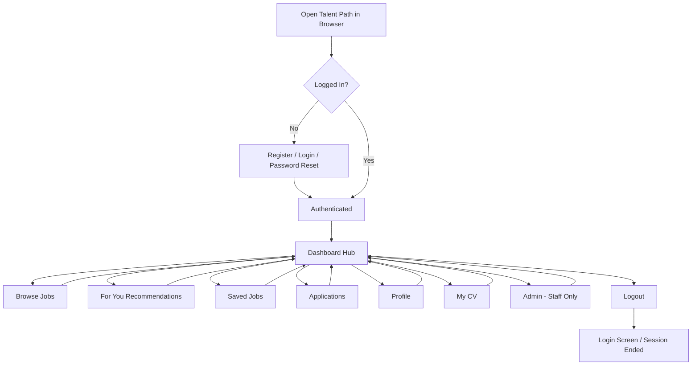
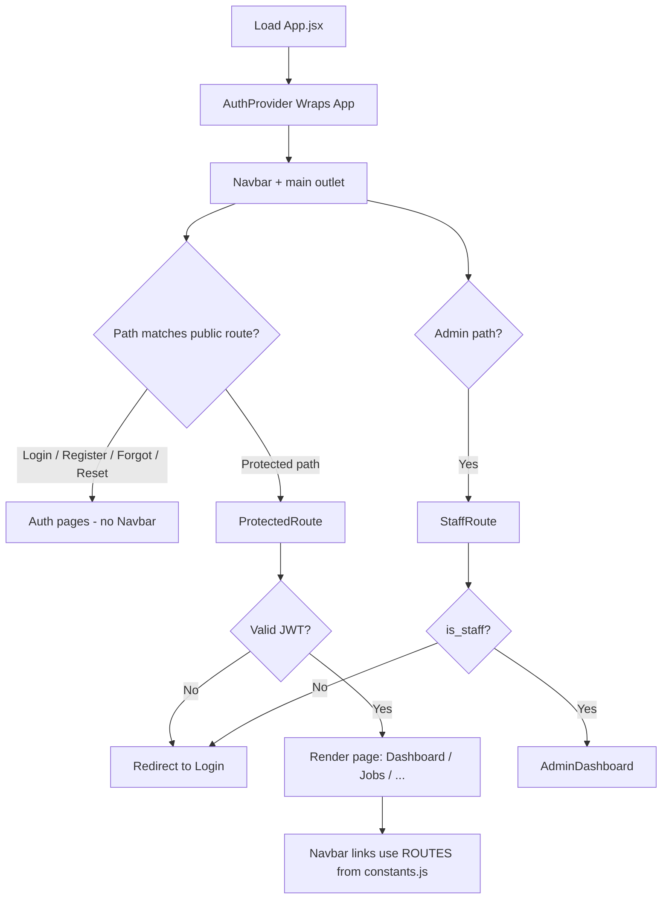
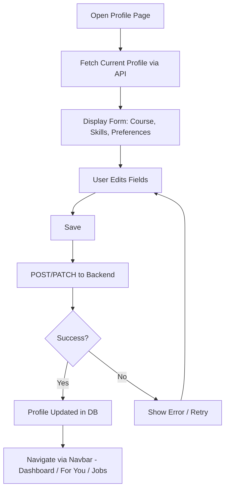
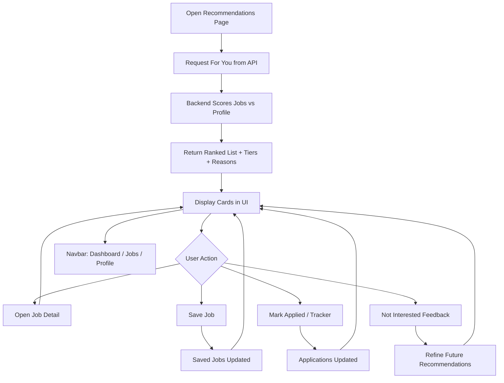
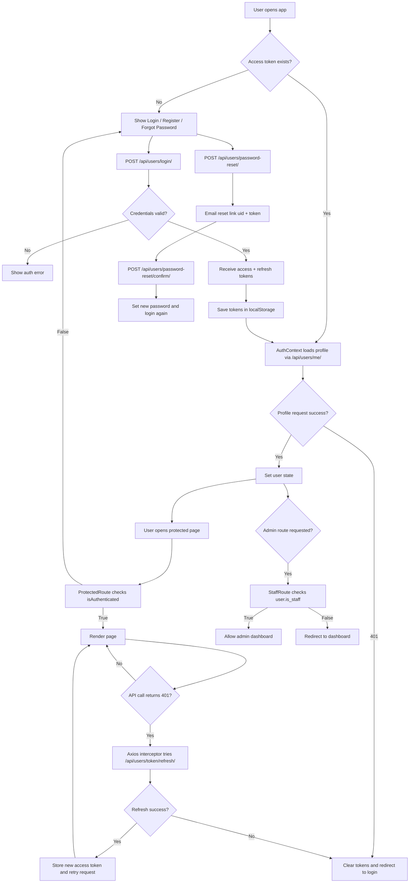

# Work Done Flowcharts — Talent Path

These flowcharts describe **Talent Path**, the web-based student job recommendation platform (React frontend, Django REST API, JWT auth). They follow the same report structure as a typical “complete app / central UI / registration module / core process” set, but use this project’s real screens and files—not facial recognition.

---

## 1. Complete Application Flowchart

**Description:**  
This flowchart illustrates the overall structure and navigation of **Talent Path**. The process begins when the user opens the web application. Unauthenticated users can **register** or **log in** (with optional password reset flows). After authentication, the user lands on the **Dashboard**, which acts as the main hub.

From the Dashboard and the **navigation bar**, the user can reach:

- **Browse Jobs** — search and filter vacancies from the integrated job feed; open job details; save jobs or mark applications.
- **For You** — personalised recommendations with match tiers and short explanation reasons; save, apply, or mark jobs as not interested.
- **Saved Jobs** — review and manage shortlisted roles.
- **Applications** — track application status and notes.
- **Profile** — edit student profile, course, skills, and preferences used for matching.
- **My CV** — build and preview a CV, with print/export.
- **Admin** *(staff only)* — administrative dashboard.
- **Logout** — ends the session and returns to the login screen.

Navigation between areas uses **React Router** links and the **Navbar**; users can return to the **Dashboard** via the logo link or by choosing routes from the bar, which plays the same organisational role as a “home + back” pattern in a desktop app.

**Figure 1: Overall App Flowchart**  
Shows complete navigation of Talent Path from entry through authentication to the main student-facing modules.



---

## 2. App Shell and Routing Flowchart

**Description:**  
This flowchart focuses on the **central routing layer**, implemented in `frontend/src/App.jsx` together with `frontend/src/utils/constants.js` (`ROUTES`) and the **Navbar** (`frontend/src/components/Navbar.jsx`). When the app loads:

- **React Router** maps URL paths to page components (Dashboard, Jobs, Saved Jobs, Applications, Recommendations, Profile, CV, Admin).
- **Protected routes** wrap pages that require a valid JWT; unauthenticated users are redirected to login.
- **Staff routes** restrict Admin to staff users.
- The **Navbar** (visible when logged in) provides the main navigation: Browse Jobs, Applications, For You, Profile, and Admin for staff; the **Talent Path** logo links to the Dashboard.

`App.jsx` is effectively the **control panel** of the single-page application: it decides which screen renders for each URL and keeps auth boundaries consistent.

**Figure 2: App Shell and Routing Flowchart**  
Outlines how the main layout, routes, and navbar connect users to Browse Jobs, For You, Profile, and other features.



---

## 3. Profile Module Flowchart

**Description:**  
This flowchart represents the **student profile** workflow, implemented in `frontend/src/pages/Profile.jsx` and backed by profile APIs on the Django side. It is the place where the user **registers** their academic and preference data for the recommender (similar in role to a “register new student” module in other projects, but here it is form-based, not camera-based).

Typical steps:

1. The user opens **Profile** from the Navbar or Dashboard.
2. The app loads existing profile fields (name, course, skills, location and job-type preferences, etc.).
3. The user edits fields and saves; data is sent to the API and stored in the database.
4. A complete profile improves **For You** matching quality; incomplete profiles still work but produce more generic recommendations.
5. The user navigates away via the Navbar (e.g. back to Dashboard or to **For You**).

This module ensures each user has a structured record that the recommendation logic can use together with implicit signals (saved and applied jobs).

**Figure 3: Profile Module Flowchart**  
Shows how profile data is loaded, edited, saved, and used as input to recommendations.



---

## 4. Recommendations (For You) Flowchart

**Description:**  
This flowchart illustrates the **personalised job list** flow in `frontend/src/pages/Recommendations.jsx`, backed by the recommendations API. It is the core “match and act” loop for Talent Path (analogous to a recognition pipeline in other projects, but here it uses profile and job text, not images).

1. The user opens **For You** from the Navbar or Dashboard.
2. The client requests ranked jobs from the backend; the server scores vacancies against the profile (and related signals), returns **match tiers**, **scores**, and **reasons**.
3. The user can open a job, **save** it, move toward **application** tracking, or mark **not interested** to refine future lists.
4. If the profile is sparse, results may be broader; the UI still explains what it can.
5. The user returns to the Dashboard or other sections via the Navbar.

**Figure 4: For You Recommendations Flowchart**  
Illustrates loading personalised results, reviewing match explanations, and saving or acting on jobs.



---

*Figures can be exported from Mermaid (or redrawn in Visio / draw.io) for the final PDF; captions above match standard report wording.*

---

## 5. Authentication Logic (Implementation Evidence)

**Description:**  
This flowchart documents the real authentication path implemented across `frontend/src/auth/AuthContext.jsx`, `frontend/src/api/axios.js`, `frontend/src/auth/ProtectedRoute.jsx`, `frontend/src/auth/StaffRoute.jsx`, and `student-job-recommender/backend/users/views.py` + `student-job-recommender/backend/users/urls.py`.

It shows:

- Credential login via `/api/users/login/` (JWT access + refresh).
- Token storage in localStorage using `TokenService`.
- Auto-attaching bearer token on protected API calls through Axios interceptors.
- Auto-refresh on `401` using `/api/users/token/refresh/`.
- Route protection for signed-in users and staff-only admin access.
- Password reset request + confirm flow.

**Figure 5: Authentication Logic Flowchart**  
Shows end-to-end auth control from login to token refresh, protected routes, staff checks, and password reset.



---

## 6. Important Code to Show Work Done

Use these files as your core implementation evidence in report screenshots and appendix extracts.

| Area | File(s) to cite | Why it proves work done |
|------|------------------|--------------------------|
| Auth API contract | `frontend/src/api/auth.api.js` | Centralized endpoints for login, register, reset, refresh, and profile requests |
| Token lifecycle | `frontend/src/utils/token.js` | Explicit token set/get/remove behavior used by the whole frontend |
| Request auth + auto-refresh | `frontend/src/api/axios.js` | Interceptors attach bearer token and recover from expired access token |
| Session bootstrap + login/logout | `frontend/src/auth/AuthContext.jsx` | User state initialization, login flow, error handling, logout behavior |
| Protected navigation | `frontend/src/auth/ProtectedRoute.jsx` | Enforces authentication gate on private pages |
| Role-based access | `frontend/src/auth/StaffRoute.jsx` | Enforces staff-only admin access using `user.is_staff` |
| Route-level enforcement | `frontend/src/App.jsx` | Wraps private routes in `ProtectedRoute` and admin route in `StaffRoute` |
| Backend token issue + reset | `student-job-recommender/backend/users/views.py` | Implements login serializer use, reset request, reset confirm logic |
| Backend auth endpoints | `student-job-recommender/backend/users/urls.py` | Maps register/login/refresh/reset/me endpoints used by frontend |

---

## 7. Recommendations (Next Iteration)

These are practical improvements based on the current implementation.

1. **Move tokens from localStorage to HttpOnly cookies** where possible to reduce XSS exposure risk.
2. **Add frontend retry/backoff policy** for transient API failures (not only 401 refresh paths).
3. **Add automated auth tests** (happy path + expiry + invalid refresh + staff route checks) to reduce regression risk.
4. **Introduce refresh token rotation / blacklist strategy** in backend for stronger session security.
5. **Add audit logging for auth events** (login success/failure, reset requests) for monitoring and incident response.
6. **Tighten frontend debug logging** by removing console logs in production builds.
7. **Document token expiry UX** (message + redirect behavior) in user-facing help so session expiration feels intentional.

---

## 8. Code Used (Paste into Report Appendix)

The snippets below are taken directly from the implemented project files and can be pasted into your report as proof of work done.

### 8.1 Frontend auth endpoints (`frontend/src/api/auth.api.js`)

```javascript
export const authAPI = {
  login: (email, password) =>
    axiosInstance.post('/api/users/login/', { email, password }),

  register: (userData) =>
    axiosInstance.post('/api/users/register/', userData),

  requestPasswordReset: (email) =>
    axiosInstance.post('/api/users/password-reset/', { email }),

  confirmPasswordReset: ({ uid, token, new_password }) =>
    axiosInstance.post('/api/users/password-reset/confirm/', { uid, token, new_password }),

  refreshToken: (refresh) =>
    axiosInstance.post('/api/users/token/refresh/', { refresh }),

  getProfile: () =>
    axiosInstance.get('/api/users/me/'),
};
```

### 8.2 Token storage utility (`frontend/src/utils/token.js`)

```javascript
export const TokenService = {
  getAccessToken: () => localStorage.getItem('access_token'),
  getRefreshToken: () => localStorage.getItem('refresh_token'),
  setTokens: (access, refresh) => {
    localStorage.setItem('access_token', access);
    if (refresh) localStorage.setItem('refresh_token', refresh);
  },
  removeTokens: () => {
    localStorage.removeItem('access_token');
    localStorage.removeItem('refresh_token');
  },
  isAuthenticated: () => !!localStorage.getItem('access_token'),
};
```

### 8.3 Axios auth interceptor + token refresh (`frontend/src/api/axios.js`)

```javascript
axiosInstance.interceptors.request.use((config) => {
  const token = TokenService.getAccessToken();
  const url = config.url || "";
  const isAuthEndpoint =
    url.includes("/api/users/login/") ||
    url.includes("/api/users/register/") ||
    url.includes("/api/users/token/refresh/");

  if (token && !isAuthEndpoint) {
    config.headers.Authorization = `Bearer ${token}`;
  }
  return config;
});

axiosInstance.interceptors.response.use(
  (response) => response,
  async (error) => {
    const originalRequest = error.config;
    if (error.response?.status === 401 && !originalRequest._retry) {
      originalRequest._retry = true;
      const refreshToken = TokenService.getRefreshToken();
      if (!refreshToken) {
        TokenService.removeTokens();
        return Promise.reject(error);
      }
      const refreshResponse = await axios.post(`${API_BASE_URL}/api/users/token/refresh/`, {
        refresh: refreshToken,
      });
      const { access } = refreshResponse.data;
      TokenService.setTokens(access, refreshToken);
      originalRequest.headers.Authorization = `Bearer ${access}`;
      return axiosInstance(originalRequest);
    }
    return Promise.reject(error);
  }
);
```

### 8.4 Auth context login/logout flow (`frontend/src/auth/AuthContext.jsx`)

```javascript
const login = useCallback(async (email, password) => {
  const normalizedEmail = (email || "").trim().toLowerCase();
  const response = await authAPI.login(normalizedEmail, password);
  const access = response.data.access;
  const refresh = response.data.refresh;
  TokenService.setTokens(access, refresh);
  axiosInstance.defaults.headers.common["Authorization"] = `Bearer ${access}`;
  const userResponse = await authAPI.getProfile();
  setUser(userResponse.data);
  return { success: true };
}, []);

const logout = useCallback(() => {
  TokenService.removeTokens();
  setUser(null);
}, []);
```

### 8.5 Protected and staff routes (`frontend/src/auth/ProtectedRoute.jsx`, `frontend/src/auth/StaffRoute.jsx`)

```javascript
// ProtectedRoute.jsx
return isAuthenticated() ? children : <Navigate to={ROUTES.LOGIN} />;
```

```javascript
// StaffRoute.jsx
if (!isAuthenticated()) return <Navigate to={ROUTES.LOGIN} replace />;
if (!user?.is_staff) return <Navigate to={ROUTES.DASHBOARD} replace />;
return children;
```

### 8.6 Backend JWT login endpoint mapping (`student-job-recommender/backend/users/urls.py`)

```python
urlpatterns = [
    path("register/", RegisterView.as_view(), name="register"),
    path("login/", EmailTokenObtainPairView.as_view(), name="token_obtain_pair"),
    path("password-reset/", PasswordResetRequestView.as_view(), name="password_reset_request"),
    path("password-reset/confirm/", PasswordResetConfirmView.as_view(), name="password_reset_confirm"),
    path("token/refresh/", TokenRefreshView.as_view(), name="token_refresh"),
    path("me/", StudentProfileView.as_view(), name="student_profile"),
]
```

### 8.7 Backend password reset logic (`student-job-recommender/backend/users/views.py`)

```python
class PasswordResetConfirmView(views.APIView):
    permission_classes = [permissions.AllowAny]

    def post(self, request):
        serializer = PasswordResetConfirmSerializer(data=request.data)
        serializer.is_valid(raise_exception=True)
        uid_b64 = serializer.validated_data["uid"]
        token = serializer.validated_data["token"]
        new_password = serializer.validated_data["new_password"]

        uid = force_str(urlsafe_base64_decode(uid_b64))
        user = User.objects.get(pk=uid)

        if not default_token_generator.check_token(user, token):
            return Response(
                {"detail": "Invalid or expired reset link. Please request a new one."},
                status=status.HTTP_400_BAD_REQUEST,
            )

        validate_password(new_password, user=user)
        user.set_password(new_password)
        user.save()
        return Response({"detail": "Your password has been reset. You can sign in now."}, status=status.HTTP_200_OK)
```

### 8.8 Recommendation-linked security improvement snippet (proposed)

Use this in your recommendations chapter to show a concrete next-step hardening task:

```javascript
// Example: remove debug logs in production
if (import.meta.env.DEV) {
  console.log("LOGIN RESPONSE:", response.data);
}
```
